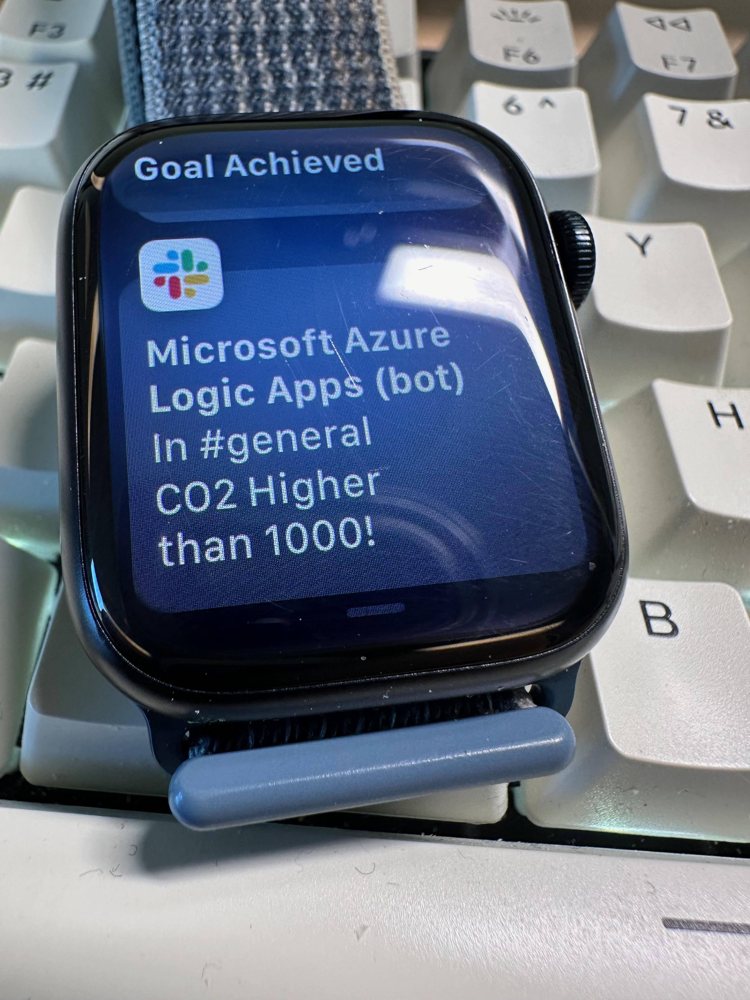

# cotwoalertsapp

## Problem

I recently bhought a ViewPlus device by AirThings to monitor the quality of my flat air: for example the device measures temperature, CO2, VOC, humidity and the data is available in a web dashboard or a smartphone app.
If one of the measures is out of expected range, you can take actions like opening the window and let fresh air in. For example, is important to keep CO2 below a certain threshold for focus and health. But monitoring without an explicit alert is very hard: as I spend the day working in front of my pc is very hard to remember to monitor the data and open the window if necessary.

I understand that opening a window and let fresh air in are simple actions that don't really need a device and all this project but I'm obviously doing it for the fun of developing :P

## Solution

The solution for the problem is simple as this diagram: 

* the sensor monitors the quality of the air
* if CO2 is higher than 1000 ppm, a notification is sent to the Smart Watch

## System

## Diagram

Below the system diagram developed and running on Azure.

## Description

1. The ViewPlus device is connected to the wifi network and the data is accessible with an API. The [AirthingsAPI](./airthingsAPI.py) script call the API and gets a snapshot of seven measures (CO2, humidity, PM1, PM25, Pressure, Radon, VOC) and the timestamp.

2. This script is executed every 40 minutes with an [Azure Function](./function_app.py) app 

3. The [AirthingsAPI](./airthingsAPI.py) script, after querying the AirThings API, sends the data as an event to an Azure Event Hub.

4. An Azure Stream Analytics job, processes the data and:
    * saves it an Azure Storage account for future analysis
    * checks if the CO2 measure is higher than 1000 ppm. 

5. If this is the case the data is sent to another event hub.

6. Once the data is sent to the event hub, an Azure logic app triggers a message on Slack.

7. The message on slack:

